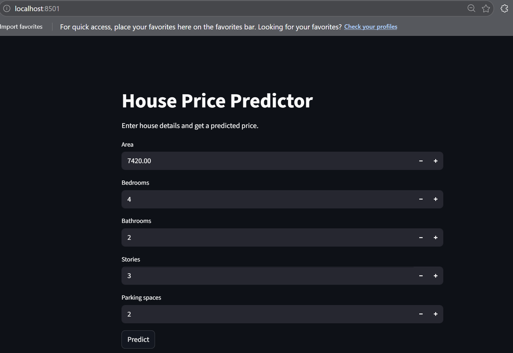
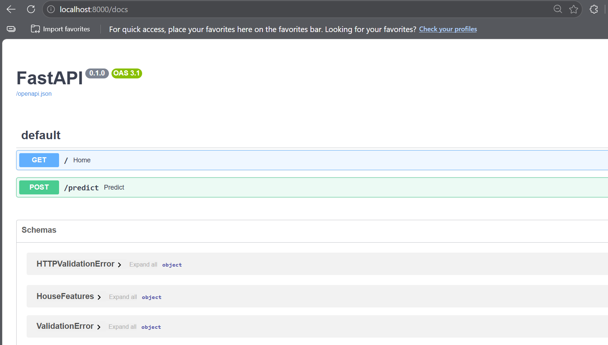
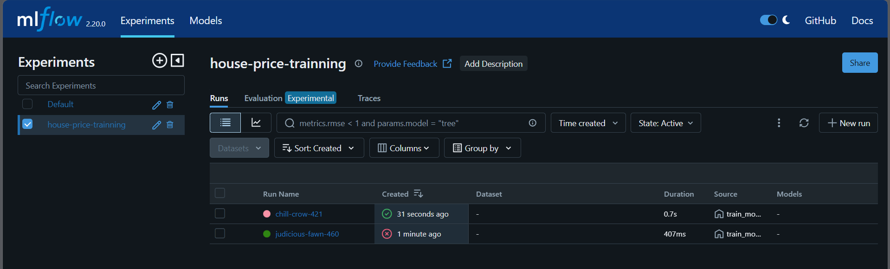
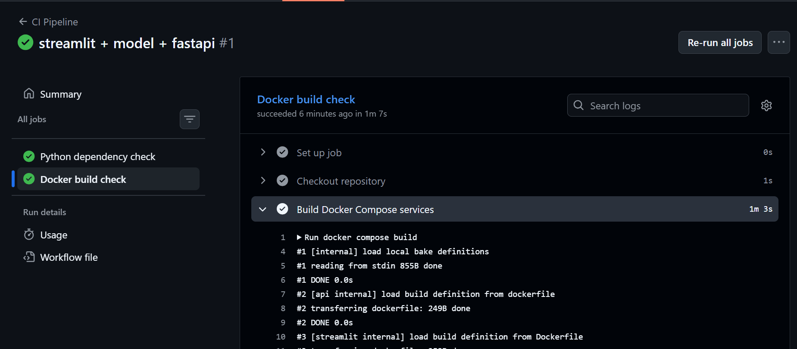
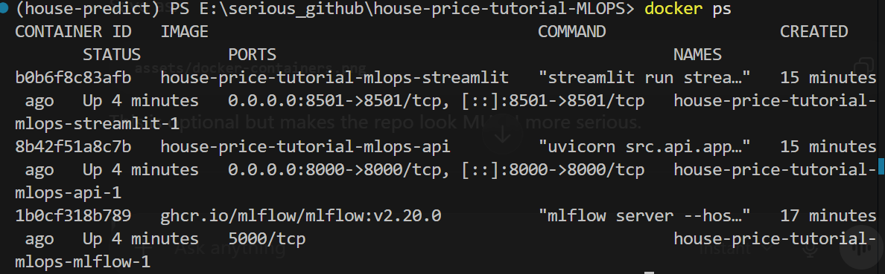

# House Price Prediction MLOps Project

## Project Overview

This project is part of my hands-on learning journey into MLOps and machine learning system design.
Instead of focusing only on training a machine learning model inside notebooks, I wanted to understand how modern ML systems are structured and deployed in real-world environments.

The goal of this project was to explore how different components of an ML system connect together, including:

* Data processing
* Feature engineering
* Model training
* Experiment tracking
* API serving
* Frontend interaction
* Docker containerization
* CI automation with GitHub Actions

This repository is intentionally built as a learning-focused project while still following clean engineering practices and modular project structure.

---

# System Architecture

```text
User
 ↓
Streamlit Frontend
 ↓
FastAPI Prediction API
 ↓
Trained Machine Learning Model

Training Pipeline
 ↓
MLflow Experiment Tracking
```

---

# Technologies Used

| Category            | Technologies           |
| ------------------- | ---------------------- |
| Programming         | Python                 |
| Machine Learning    | scikit-learn           |
| API Backend         | FastAPI                |
| Frontend            | Streamlit              |
| Experiment Tracking | MLflow                 |
| Containerization    | Docker, Docker Compose |
| CI/CD               | GitHub Actions         |
| Data Handling       | Pandas, NumPy          |
| Model Serialization | Joblib                 |

---

# Project Structure

```text
house-price-mlops/
│
├── assets/
├── data/
├── deployment/
│   └── mlflow/
├── models/
├── notebooks/
├── src/
│   ├── api/
│   ├── data/
│   ├── features/
│   ├── models/
│   └── config.py
│
├── streamlit_app/
├── tests/
├── docker-compose.yml
├── Dockerfile
├── requirements.txt
└── README.md
```

---

# Features

* End-to-end machine learning workflow
* Modular data processing pipeline
* Feature engineering pipeline
* Machine learning model training
* MLflow experiment tracking
* FastAPI prediction service
* Streamlit frontend interface
* Dockerized multi-service architecture
* GitHub Actions CI pipeline
* Environment variable configuration with `.env`

---

# Screenshots

## Streamlit Frontend



---

## FastAPI Swagger Documentation



---

## MLflow Experiment Tracking



---

## GitHub Actions CI Pipeline



---

## Docker Containers Running



---

# What I Learned From This Project

This project helped me better understand the difference between:

```text
training a machine learning model
vs
building a machine learning system
```

Some of the main concepts I explored include:

* Structuring ML projects professionally
* Separating training and inference pipelines
* Experiment tracking with MLflow
* API-based model serving
* Frontend/backend communication
* Docker container networking
* Multi-container orchestration with Docker Compose
* CI automation using GitHub Actions
* Environment configuration management

One of the biggest lessons from this project was understanding how modern ML systems involve much more than just notebooks and model training.

---

# Running The Project

## Clone Repository

```bash
git clone https://github.com/YOUR_USERNAME/house-price-mlops.git

cd house-price-mlops
```

---

## Create Environment

```bash
conda create -n house_mlop python=3.11 -y

conda activate house_mlop
```

---

## Install Dependencies

```bash
pip install -r requirements.txt
```

---

# Run With Docker Compose

```bash
docker compose up --build
```

---

# Services

| Service            | URL                        |
| ------------------ | -------------------------- |
| Streamlit Frontend | http://localhost:8501      |
| FastAPI Docs       | http://localhost:8000/docs |
| MLflow Dashboard   | http://localhost:5555      |

---

# Future Improvements

Some areas I would like to continue exploring in future iterations of this project:

* Model versioning
* Automated retraining pipelines
* Unit and integration testing
* Cloud deployment (AWS/GCP/Azure)
* Model monitoring and logging
* DVC for dataset versioning
* Kubernetes orchestration
* Database integration
* Authentication and API security

---

# Notes

This project is primarily focused on learning and experimentation while trying to follow professional engineering practices where possible.

The goal is not to present this as a production-ready enterprise platform, but rather as a practical exploration of modern MLOps concepts through hands-on implementation.

---
